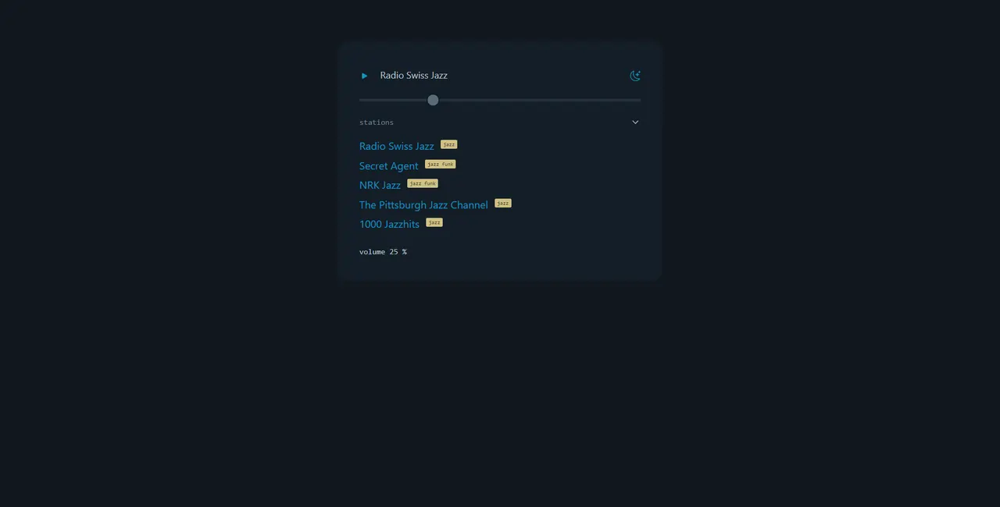

# sinuous_radio_player
simple fast reactive radio player made with esbuild, sinuous jsx library, shuffle-letters.js &amp; pico css

<a href="https://rwdevelopment.github.io/sinuous_radio_player" target="_blank">Live demo</a>

